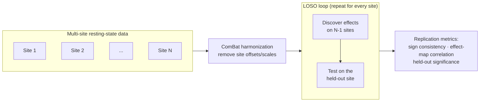
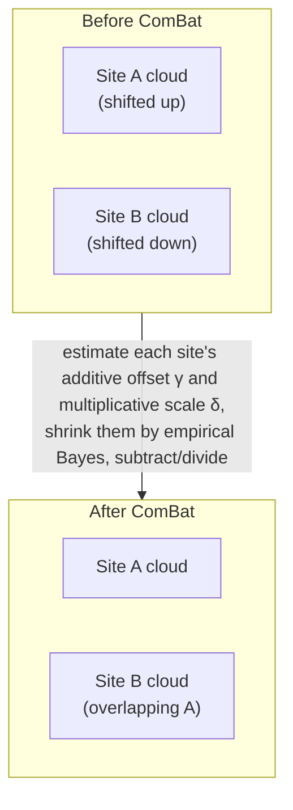
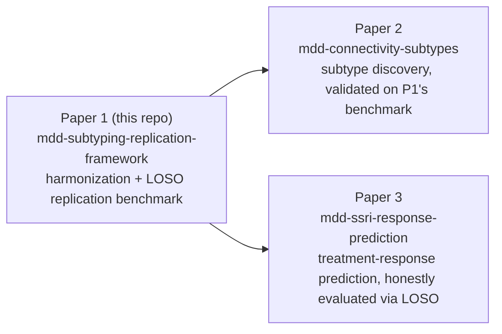

# Extended Introduction — for Readers with No Neuroscience Background

This page explains the project from absolute zero. If you already know what fMRI and resting-state connectivity are, you probably want [INTRODUCTION.md](INTRODUCTION.md) (the scientific introduction) instead. Everything here is stated in plain language; where the mathematics gets interesting we link to excellent free resources rather than re-teaching them.

## The clinical problem: what is depression (MDD)?

Major depressive disorder (MDD) — what most people mean by "clinical depression" — is a medical diagnosis for a state in which a person experiences persistently low mood and/or inability to feel pleasure, along with symptoms like disrupted sleep, appetite changes, exhaustion, poor concentration, and feelings of worthlessness, lasting at least two weeks and seriously impairing daily life. It is one of the most common and most disabling conditions on the planet.

Two uncomfortable facts motivate this project:

1. **Diagnosis is based on symptoms, not biology.** There is no blood test or brain scan for depression. A clinician asks questions and checks boxes. Two people can both be diagnosed with MDD while sharing almost no symptoms — one sleeps too much and can't eat, the other can't sleep and overeats.
2. **Patients differ enormously in outcome.** Some respond to the first antidepressant; others try five medications and therapy without relief. This heterogeneity suggests that "depression" might actually be several different biological conditions wearing the same symptomatic coat [1].

If that's true, finding the biological "subtypes" could eventually guide treatment. But before we can trust any proposed subtype, we need to know whether the brain findings it rests on *replicate* — which is what this repository tests.

## What does fMRI measure?

Functional magnetic resonance imaging (fMRI) does not photograph the brain's cells or "read thoughts." It measures a blood-oxygen signal: when a patch of brain is more active, its neurons demand more oxygen, and blood flow to that patch increases within a couple of seconds. Oxygenated and deoxygenated blood respond differently to magnetic fields, so the scanner can detect where blood is flowing in greater volume. The signal is called BOLD (blood-oxygen-level dependent).

**Analogy:** imagine you want to know which neighborhoods of a city are busy, but you can't look at the city directly — you can only watch traffic flow on its roads. More cars heading toward a district roughly means more activity there. That's fMRI: blood flow as a proxy for neural activity. It's indirect, delayed by a few seconds, and noisy — but it's the best non-invasive whole-brain measurement we have.

## What is "resting-state connectivity"?

In a resting-state scan, the person simply lies in the scanner doing nothing — no task, no stimulus. Surprisingly, the brain is not idle: different regions show slow, rhythmic fluctuations in activity, and regions that work together tend to fluctuate in sync. Two regions whose rhythms rise and fall together are said to be **functionally connected**.

**Analogy:** sit in a quiet park and listen to a city. You'll notice that the sounds from the harbor district and the ferry terminal swell and fade together, while the financial district has its own rhythm. Without anyone telling you the city's geography, you could map "which districts work together" purely from synchronized sound. Resting-state fMRI does this for the brain, and the synchronized groups of regions form well-known **networks** — the default mode network (active during mind-wandering and self-referential thought), frontoparietal control, salience, attention, and limbic networks.

Depression research has repeatedly reported that some of these networks — especially the default mode network (DMN) — are wired differently in MDD patients than in healthy controls [1][2]. The flagship result from the dataset we target: reduced DMN connectivity in recurrent MDD [1].

## The replication crisis — and the Drysdale story

Across science, and especially in psychology and neuroimaging, many celebrated findings turned out not to repeat when other teams tried them. This is the **replication crisis**. Brain-imaging studies of depression are a poster child: most were small (tens of subjects), analyses were flexible (hundreds of brain connections can each be tested until something "significant" pops out), and every hospital's scanner adds its own quirks. Varoquaux showed quantitatively that at typical neuroimaging sample sizes, the uncertainty on cross-validated results is enormous — so a single small study can look wildly better than the truth [5].

The most famous episode in our field, in plain terms:

- In 2017, **Drysdale et al.** published a high-profile paper claiming that patterns of resting-state connectivity define four distinct biological "biotypes" of depression — and that these biotypes predicted who would respond to a magnetic-stimulation treatment (rTMS) [3]. The implication was thrilling: scan a patient, learn their biotype, pick the right treatment.
- In 2019, **Dinga et al.** redid the analysis carefully in an independent sample, applying the appropriate statistical tests that the original paper had skipped [4]. The claimed correlation structure and the clusters were **not statistically significant**. The biotypes evaporated under scrutiny.

The lesson isn't that brain-based depression subtypes are impossible — it's that **claims must be tested on data the discovery process never touched**, ideally at hospitals the analysis has never seen. That is precisely the test this project builds.

## Batch effects: every scanner is a different microphone

Even if you record the same song on two different brands of microphone, the recordings differ: one is brighter, one is bassier. Nobody would conclude the singer changed. MRI scanners are the same: a Siemens scanner and a GE scanner, or even the same model at two hospitals with different calibration, produce systematically different numbers for the same brain. These systematic site-to-site differences are called **batch effects** or **site effects**.

Batch effects are deadly for multi-site research because they can masquerade as biology: if site A happens to scan more severely ill patients and also runs "brighter" than site B, a naive analysis can confuse microphone for singer. The standard remedy is **ComBat harmonization** [6], described below.

## What this project does

This repository builds a **fair test of whether brain findings travel**. Concretely:

1. Take resting-state connectivity features from many scanning sites (target: REST-meta-MDD Phase II, ~2,400 subjects, ~25 sites [8]; current demo runs on synthetic data).
2. **Harmonize** them with ComBat so site-specific "microphone" quirks are removed while real biological differences are preserved.
3. Run a **leave-one-site-out (LOSO)** loop: pretend one hospital doesn't exist, discover the case–control effects on the remaining sites, then ask whether those effects show up at the hidden hospital. Repeat, hiding each site in turn.
4. Score replication with three metrics (sign consistency, effect-map correlation, held-out significance) against a registry of 8 published MDD connectivity findings.

## The math, in one sentence each

- **Effect size (Cohen's d):** how far apart the patient and control averages are, measured in units of their shared spread — "the groups differ by half a standard deviation" means d = 0.5. Primer: [StatQuest — Cohen's d](https://statquest.org/).
- **Correlation:** a number from −1 to +1 saying how tightly two quantities move together; we use it to ask whether the *pattern* of effects found at training sites matches the pattern at the held-out site. Primer: [Seeing Theory — correlation](https://seeing-theory.brown.edu/) and [3Blue1Brown](https://www.3blue1brown.com/).
- **ComBat location/scale adjustment:** for each feature, ComBat estimates each site's additive offset γ and multiplicative scale δ and removes them, roughly `adjusted = (value − γ_site) / δ_site`, where γ and δ are *shrunk* toward the average across sites using empirical Bayes — small sites borrow strength from large ones instead of trusting their own noisy estimates [6]. Background on priors/shrinkage: [Khan Academy — statistics](https://www.khanacademy.org/math/statistics-probability) and StatQuest's empirical Bayes videos.

We deliberately link out for the fundamentals rather than re-teaching them; the repo's own implementation notes live in [METHODS.md](METHODS.md).

## The three-paper series

This repository is Paper 1 of 3 — the foundation that the others reuse.

## Where the project stands

The framework — ComBat harmonization, the LOSO loop, the findings registry, staging scripts, and a synthetic demo — is implemented and tested. A synthetic demo (6 sites × 240 subjects, with planted biological effects and planted site shifts) runs end-to-end via `make benchmark-demo` and achieves a mean sign consistency of 0.760 (full outputs in `reports/loso/`). Real-data analysis awaits approval of the REST-meta-MDD Phase II data-use agreement; see [DATA_ACCESS.md](DATA_ACCESS.md).

## References

1. Yan C-G, et al. Reduced default mode network functional connectivity in patients with recurrent major depressive disorder. *PNAS* 2019;116(18):9078–9083. doi:10.1073/pnas.1900390116
2. Kaiser RH, et al. Large-scale network dysfunction in major depressive disorder: a meta-analysis of resting-state functional connectivity. *JAMA Psychiatry* 2015;72(6):603–611. doi:10.1001/jamapsychiatry.2015.0071
3. Drysdale AT, et al. Resting-state connectivity biomarkers define neurophysiological subtypes of depression. *Nature Medicine* 2017;23(1):28–38. doi:10.1038/nm.4246
4. Dinga R, et al. Evaluating the evidence for biotypes of depression. *NeuroImage: Clinical* 2019;22:101796. doi:10.1016/j.nicl.2019.101796
5. Varoquaux G. Cross-validation failure: small sample sizes lead to large error bars. *NeuroImage* 2018;180:68–77. doi:10.1016/j.neuroimage.2017.06.061
6. Fortin J-P, et al. Harmonization of cortical thickness measurements across scanners and sites. *NeuroImage* 2018;167:104–120. doi:10.1016/j.neuroimage.2017.11.024
8. Chen X, et al. The DIRECT consortium and the REST-meta-MDD project. *Psychoradiology* 2022;2(1):32–42. doi:10.1093/psyrad/kkac005
