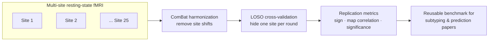
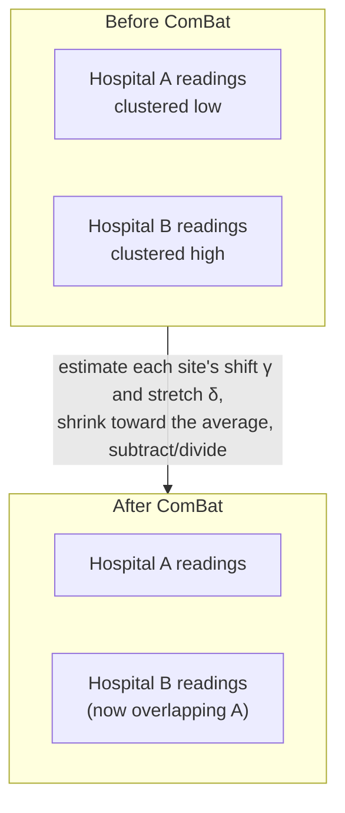
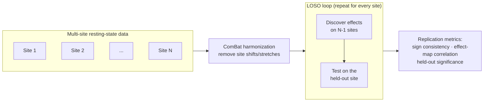
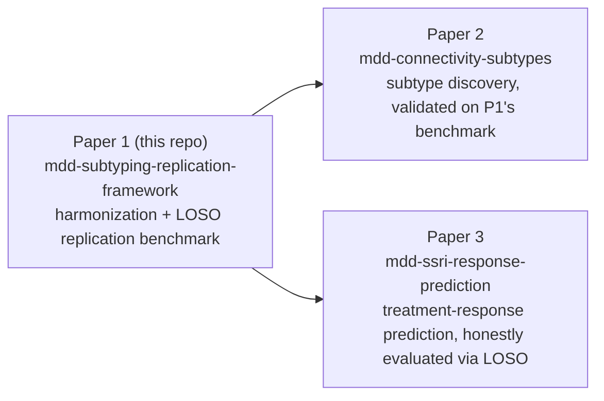

# Extended Introduction — for Readers with No Neuroscience Background

This page explains the project from absolute zero. No statistics or medical background is assumed: every technical idea is first shown on a tiny made-up example you can check by hand, then given intuition, and only then named. If you already know what fMRI and resting-state connectivity are, you probably want [INTRODUCTION.md](INTRODUCTION.md) (the scientific introduction) instead.

**Concept figure.** The whole pipeline in one picture — multi-site data in, harmonization, hide-one-hospital testing, replication scoring, and a benchmark the rest of the series reuses (standalone version: [figures/concept_figure.md](figures/concept_figure.md)):

## The clinical problem: what is depression (MDD)?

Major depressive disorder (MDD) — what most people mean by "clinical depression" — is a medical diagnosis for a state in which a person experiences persistently low mood and/or inability to feel pleasure, along with symptoms like disrupted sleep, appetite changes, exhaustion, poor concentration, and feelings of worthlessness, lasting at least two weeks and seriously impairing daily life. It is one of the most common and most disabling conditions on the planet.

Two uncomfortable facts motivate this project:

1. **Diagnosis is based on symptoms, not biology.** There is no blood test or brain scan for depression. A clinician asks questions and checks boxes. Two people can both be diagnosed with MDD while sharing almost no symptoms — one sleeps too much and can't eat, the other can't sleep and overeats.
2. **Patients differ enormously in outcome.** Some respond to the first antidepressant; others try five medications and therapy without relief. This heterogeneity suggests that "depression" might actually be several different biological conditions wearing the same symptomatic coat [1].

If that's true, finding the biological "subtypes" could eventually guide treatment. But before we can trust any proposed subtype, we need to know whether the brain findings it rests on *replicate* — which is what this repository tests.

## What does fMRI measure?

Functional magnetic resonance imaging (fMRI) does not photograph the brain's cells or "read thoughts." It measures a blood-oxygen signal: when a patch of brain is more active, its neurons demand more oxygen, and blood flow to that patch increases within a couple of seconds. Oxygenated and deoxygenated blood respond differently to magnetic fields, so the scanner can detect where blood is flowing in greater volume. The signal is called BOLD (blood-oxygen-level dependent).

**Analogy:** imagine you want to know which neighborhoods of a city are busy, but you can't look at the city directly — you can only watch traffic flow on its roads. More cars heading toward a district roughly means more activity there. That's fMRI: blood flow as a proxy for neural activity. It's indirect, delayed by a few seconds, and noisy — but it's the best non-invasive whole-brain measurement we have.

## What is "resting-state connectivity"?

In a resting-state scan, the person simply lies in the scanner doing nothing — no task, no stimulus. Surprisingly, the brain is not idle: different regions show slow, rhythmic fluctuations in activity, and regions that work together tend to fluctuate in sync. Two regions whose rhythms rise and fall together are said to be **functionally connected**.

**Analogy:** sit in a quiet park and listen to a city. You'll notice that the sounds from the harbor district and the ferry terminal swell and fade together, while the financial district has its own rhythm. Without anyone telling you the city's geography, you could map "which districts work together" purely from synchronized sound. Resting-state fMRI does this for the brain, and the synchronized groups of regions form well-known **networks** — the default mode network (active during mind-wandering and self-referential thought), frontoparietal control, salience, attention, and limbic networks.

Depression research has repeatedly reported that some of these networks — especially the default mode network (DMN) — are wired differently in MDD patients than in healthy controls [1][2]. The flagship result from the dataset we target: reduced DMN connectivity in recurrent MDD [1].

## The replication crisis — and the Drysdale story

Across science, and especially in psychology and neuroimaging, many celebrated findings turned out not to repeat when other teams tried them. This is the **replication crisis**. Brain-imaging studies of depression are a poster child: most were small (tens of subjects), analyses were flexible (hundreds of brain connections can each be tested until something "significant" pops out), and every hospital's scanner adds its own quirks. Varoquaux showed quantitatively that at typical neuroimaging sample sizes, the uncertainty on cross-validated results is enormous — so a single small study can look wildly better than the truth [5].

The most famous episode in our field, in plain terms:

- In 2017, **Drysdale et al.** published a high-profile paper claiming that patterns of resting-state connectivity define four distinct biological "biotypes" of depression — and that these biotypes predicted who would respond to a magnetic-stimulation treatment (rTMS) [3]. The implication was thrilling: scan a patient, learn their biotype, pick the right treatment.
- In 2019, **Dinga et al.** redid the analysis carefully in an independent sample, applying the appropriate statistical tests that the original paper had skipped [4]. The claimed correlation structure and the clusters were **not statistically significant**. The biotypes evaporated under scrutiny.

The lesson isn't that brain-based depression subtypes are impossible — it's that **claims must be tested on data the discovery process never touched**, ideally at hospitals the analysis has never seen. That is precisely the test this project builds.

## Batch effects: every scanner is a different microphone

Even if you record the same song on two different brands of microphone, the recordings differ: one is brighter, one is bassier. Nobody would conclude the singer changed. MRI scanners are the same: a Siemens scanner and a GE scanner, or even the same model at two hospitals with different calibration, produce systematically different numbers for the same brain. These systematic site-to-site differences are called **batch effects** or **site effects**.

Batch effects are deadly for multi-site research because they can masquerade as biology: if site A happens to scan more severely ill patients and also runs "brighter" than site B, a naive analysis can confuse microphone for singer. The standard remedy is **ComBat harmonization** [6] — and we can see exactly how it works on six imaginary patients.

### ComBat on a tiny example

Imagine we measured one connectivity number (say, how synchronized two brain regions are) for 6 people scanned at 2 hospitals. Three patients and three healthy controls, spread across the hospitals:

| Person | Hospital | Diagnosis | Raw connectivity |
|---|---|---|---|
| P1 | A | Patient | 0.10 |
| P2 | B | Patient | 0.30 |
| P3 | B | Patient | 0.34 |
| C1 | A | Control | 0.40 |
| C2 | B | Control | 0.62 |
| C3 | A | Control | 0.46 |

Look only at the raw column and you might conclude patients differ wildly from controls *and* that patients P2/P3 (hospital B) look "less ill" than P1 (hospital A). But check the hospital averages: hospital A's numbers average (0.10+0.40+0.46)/3 ≈ **0.32**, hospital B's average (0.30+0.34+0.62)/3 ≈ **0.42**. Hospital B's scanner reads about 0.10 higher on everything — the same way one microphone records everything brighter.

Now subtract each hospital's own average shift and re-center everyone on the overall mean (0.37):

| Person | Raw | Minus hospital shift (±0.05) | Harmonized |
|---|---|---|---|
| P1 | 0.10 | +0.05 | 0.15 |
| P2 | 0.30 | −0.05 | 0.25 |
| P3 | 0.34 | −0.05 | 0.29 |
| C1 | 0.40 | +0.05 | 0.45 |
| C2 | 0.62 | −0.05 | 0.57 |
| C3 | 0.46 | +0.05 | 0.51 |

The hospital gap is gone, but the *diagnosis* gap survived: harmonized patients sit at 0.15–0.29 and controls at 0.45–0.57. That's the whole idea — **remove the microphone's accent, keep the singer's voice.**

**Intuition.** For each brain measurement, each hospital gets its own "how much too high/low am I?" correction. ComBat [6] is the careful, grown-up version of our table arithmetic: it estimates a shift (and a stretch) per hospital per measurement, and it *shrinks* small hospitals' estimates toward the average — a hospital with only 8 scans has a noisy estimate, so we trust it less and borrow strength from the big hospitals. It also protects real group differences (age, sex, diagnosis) so they are not accidentally removed along with the site effect.

**Notation, as shorthand for exactly the procedure above.** For measurement *g* of person *i* at hospital *s*:

`adjusted = (value − γ_s) / δ_s`

where `γ_s` is hospital *s*'s additive shift (the 0.05 we subtracted/added) and `δ_s` is a stretch factor (our tiny example had equal spreads, so δ = 1). The empirical-Bayes part just says: estimate γ and δ, then pull them partway toward the all-hospitals average before applying them. Nothing more.

## Leave-one-site-out: the "hide a hospital" test, on a tiny example

How do you know whether a discovered effect is real biology or a local quirk? Test it somewhere the discovery process never saw. Here is the entire idea on our 6 people. Suppose hospitals A and B above are joined by a third hospital C with patients {0.18, 0.22} and controls {0.48, 0.52}.

1. **Hide hospital C.** Using only A and B, we "discover": patients score lower than controls, by about 0.29 on average.
2. **Reveal hospital C.** Check: at C, patients average 0.20 and controls 0.50 — lower, same direction, similar size. The effect **replicated** at a hospital it had never seen.
3. **Repeat**, hiding A, then B. If the effect shows up every time, we trust it; if it only appears at the hospital where it was discovered, we don't.

**Intuition.** This is cross-validation with the harshest possible split: instead of shuffling individual people, we hold out an entire hospital — its scanner, its staff, its patient recruitment — everything. Random splitting is like studying for an exam using last year's exact questions; leaving out a whole site is like being examined by a different school.

**Notation.** With *N* hospitals, loop *s = 1…N*: discover on *N − 1* sites, evaluate on site *s*, and average the *N* scores. That's LOSO (leave-one-site-out) cross-validation — the loop in the diagram below and the backbone of this repository.

## Scoring replication without prerequisites

For each published MDD connectivity finding, the LOSO loop produces numbers, and we summarize them with three scores, each defined by what you'd do with paper and pencil:

- **Sign consistency.** The discovery said "this connection is *lower* in patients." At the hidden hospital, is it actually lower? Count the fraction of held-out hospitals where the direction matches. In our tiny example, 3 out of 3 → sign consistency 1.0. A coin-flip effect scores ≈ 0.5; the synthetic demo scores 0.760.
- **Effect-map correlation.** A finding is rarely one number — it's a *pattern* over many connections (a map). Lay the discovered map and the held-out hospital's map side by side and ask: when one is high, is the other high? That "do they rise and fall together" number is a correlation, between −1 (perfectly opposed) and +1 (perfectly matching).
- **Held-out significance.** Is the patient–control gap at the hidden hospital larger than you'd expect if diagnosis labels were meaningless? The check: shuffle the labels at that hospital many times, recompute the gap each time, and see how often the shuffled gaps beat the real one. If almost never, the effect is "significant" there. No formulas required — it's a counting argument.

## What this project does, end to end

This repository builds a **fair test of whether brain findings travel**. Concretely:

1. Take resting-state connectivity features from many scanning sites (target: REST-meta-MDD Phase II, ~2,400 subjects, ~25 sites [8]; current demo runs on synthetic data).
2. **Harmonize** them with ComBat, exactly as in the tiny table above, so site-specific "microphone" quirks are removed while real biological differences are preserved.
3. Run the **LOSO loop**: pretend one hospital doesn't exist, discover the case–control effects on the remaining sites, then ask whether those effects show up at the hidden hospital. Repeat, hiding each site in turn.
4. Score replication with the three metrics above against a registry of 8 published MDD connectivity findings.

## A word on effect size

One last number appears everywhere in this project, and it is as concrete as the rest. In the harmonized tiny table, patients average (0.15+0.25+0.29)/3 ≈ 0.23 and controls ≈ 0.51 — a gap of 0.28. Is that "big"? Depends on how spread out people are: a 0.28 gap means a lot if everyone sits within ±0.05 of their group average, and little if people scatter by ±0.5. **Cohen's d** is just the gap divided by that typical spread. "d = 0.5" literally means "the groups' averages are half a typical scatter apart." Every effect in our registry is reported this way so that findings are comparable across sites, studies, and measures.

## The three-paper series

This repository is Paper 1 of 3 — the foundation that the others reuse.

## Where the project stands

The framework — ComBat harmonization, the LOSO loop, the findings registry, staging scripts, and a synthetic demo — is implemented and tested. A synthetic demo (6 sites × 240 subjects, with planted biological effects and planted site shifts) runs end-to-end via `make benchmark-demo` and achieves a mean sign consistency of 0.760 (full outputs in `reports/loso/`). Real-data analysis awaits approval of the REST-meta-MDD Phase II data-use agreement; see [DATA_ACCESS.md](DATA_ACCESS.md).

## References

1. Yan C-G, et al. Reduced default mode network functional connectivity in patients with recurrent major depressive disorder. *PNAS* 2019;116(18):9078–9083. doi:10.1073/pnas.1900390116
2. Kaiser RH, et al. Large-scale network dysfunction in major depressive disorder: a meta-analysis of resting-state functional connectivity. *JAMA Psychiatry* 2015;72(6):603–611. doi:10.1001/jamapsychiatry.2015.0071
3. Drysdale AT, et al. Resting-state connectivity biomarkers define neurophysiological subtypes of depression. *Nature Medicine* 2017;23(1):28–38. doi:10.1038/nm.4246
4. Dinga R, et al. Evaluating the evidence for biotypes of depression. *NeuroImage: Clinical* 2019;22:101796. doi:10.1016/j.nicl.2019.101796
5. Varoquaux G. Cross-validation failure: small sample sizes lead to large error bars. *NeuroImage* 2018;180:68–77. doi:10.1016/j.neuroimage.2017.06.061
6. Fortin J-P, et al. Harmonization of cortical thickness measurements across scanners and sites. *NeuroImage* 2018;167:104–120. doi:10.1016/j.neuroimage.2017.11.024
8. Chen X, et al. The DIRECT consortium and the REST-meta-MDD project. *Psychoradiology* 2022;2(1):32–42. doi:10.1093/psyrad/kkac005
