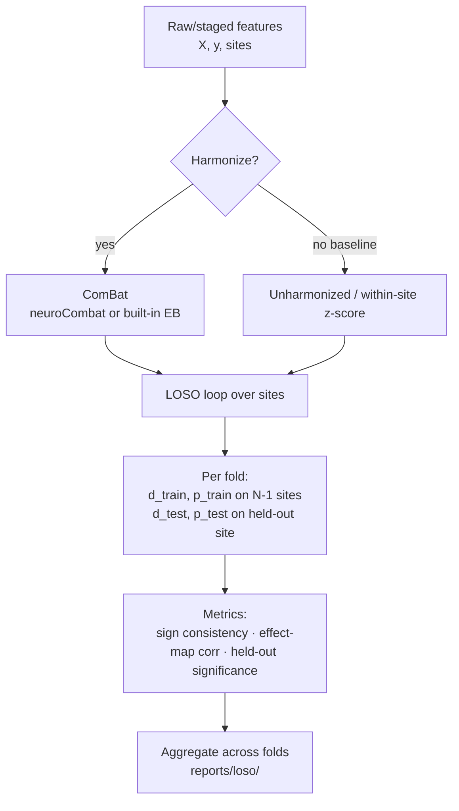
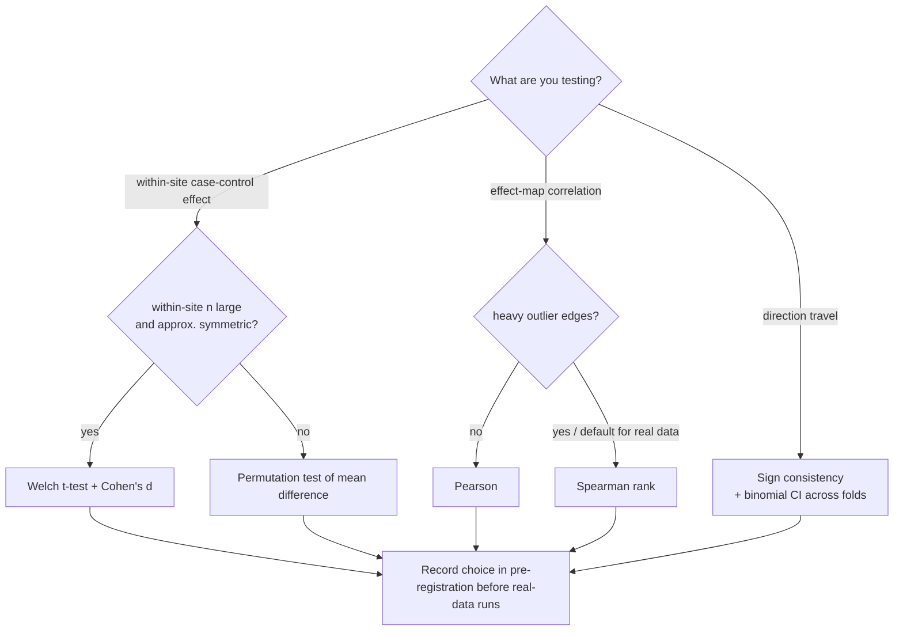

# Methods — What Is Built, What Is Planned, and Why

Audience: new contributors, including those new to data science. This document separates what **exists and is tested** from what is **intended but blocked**, explains the reasoning behind each design decision, and gives newcomers the statistics background needed to contribute safely. The scientific framing is in [INTRODUCTION.md](INTRODUCTION.md); the plain-language version is in [EXTENDED_INTRODUCTION.md](EXTENDED_INTRODUCTION.md).

## Done

| Component | Where | Status |
|---|---|---|
| ComBat harmonization (empirical Bayes) | `src/loso_replication/combat.py` | Built-in implementation of Johnson, Li & Rabinovic (2007); optional `neuroCombat` backend with automatic fallback |
| LOSO replication framework + 3 metrics | `src/loso_replication/loso.py` | Site splitting, train/test API, sign consistency, effect-map correlation, held-out significance |
| Registry of published findings | `src/loso_replication/findings.py` | 8 published MDD connectivity findings as structured effect specs (feature, expected direction, citation, DOI) |
| Staging scripts | `src/loso_replication/staging.py`, `scripts/prepare_rest_meta_mdd.py` | Expected file layout, integrity checks, conversion to `(X, y, sites)`, synthetic demo mode |
| One-command benchmark | `scripts/run_loso.py`, `Makefile` | `make benchmark` (real, post-DUA) and `make benchmark-demo` (synthetic) |
| Synthetic demo | `src/loso_replication/simulate.py`, `reports/loso/` | 6 sites × 240 subjects, planted effects + planted site shifts; demo run: mean sign consistency 0.760, effect-map correlation 0.585, held-out significance 0.895 |
| Tests | `tests/` | 19 green tests: ComBat removes planted site effects while preserving biology; LOSO recovers planted replicable effects and flags non-replicable ones; staging roundtrip |

## Intended (blocked on data access)

| Work | Tracking | Blocker |
|---|---|---|
| REST-meta-MDD Phase II DUA submission/approval | issue #2 | Owner action — see [DATA_ACCESS.md](DATA_ACCESS.md) |
| Real-data harmonization QC and batch-effect diagnostics | issue #5 | DUA |
| Real-data LOSO benchmark (~25 sites) | issue #3 | DUA |
| Paper 1 writeup and release | issue #4 | DUA + benchmark |

No real-data analysis has been run. Real data must never be committed to this repository.

## Why ComBat?

ComBat comes from genomics and was adapted to MRI by Fortin et al. (2018). It models each feature as: biology + an additive site offset (γ) + a multiplicative site scale (δ), then estimates γ and δ per site and removes them. The key trick is **empirical Bayes shrinkage**: instead of trusting each site's own noisy estimate of its offset, ComBat shrinks every site's γ and δ toward the average across all sites, with shrinkage strength inversely related to site size. A small site with 30 subjects produces a wild estimate of its own offset; ComBat pulls that estimate toward the consensus, "borrowing strength" from large sites. This matters enormously for REST-meta-MDD, where site sizes vary by an order of magnitude.

Our built-in implementation (`_builtin_combat`) follows the original paper: standardize to the grand mean and pooled variance, estimate per-batch γ̂ and δ̂, fit method-of-moments priors (normal for γ, inverse-gamma for δ), compute posterior estimates γ* and δ*, then adjust as `(x − γ*) / √δ*` and un-standardize.

## Why leave-one-SITE-out instead of random splits?

Standard cross-validation shuffles all subjects and splits randomly. In multi-site data this is a leak disguised as rigor: every hospital's subjects land in both train and test, so the model/test set "sees" every site's scanner quirks during training. A finding can score beautifully while being pure site-confounded artifact — and then fail the moment a new hospital's data arrives.

Leave-one-site-out (LOSO) makes the held-out unit an **entire site**. All discovery (effect estimation, significance calling) happens on N−1 sites; the Nth site is touched only for evaluation; then the loop repeats with a different site held out. LOSO directly answers the only question that matters for clinical translation: *does this finding show up at a hospital we've never seen?* Varoquaux (2018) showed that even honest cross-validation has huge error bars at typical sample sizes; LOSO is increasingly the minimum standard for multi-site neuroimaging claims. This is the whole point of the framework.

## The three replication metrics — and what each catches

Each LOSO fold computes a Cohen's d effect map on the training sites and on the held-out site, plus Welch t-test p-values, then scores:

1. **Sign consistency** — of the effects that were significant in training, what fraction have the same direction (sign of d) at the held-out site? Catches *direction travel*: does "patients have lower DMN connectivity" even point the same way at a new hospital? A finding can pass this while being trivially small, so sign alone isn't enough.
2. **Effect-map correlation** — Pearson correlation between the full training effect map (d per feature) and the held-out effect map, over all features, not just significant ones. Catches *pattern travel*: the whole fingerprint of strong/weak effects should look similar, preventing cherry-picking of one lucky connection.
3. **Held-out significance** — fraction of training-significant effects that are also nominally significant (p < α) at the held-out site. Catches *statistical travel*: the strictest test, because held-out sites are small (tens of subjects) and power is low.

Synthetic demo values (6 sites × 240 subjects): sign consistency 0.760, effect-map correlation 0.585, held-out significance 0.895 — note how held-out significance is highest here because the planted synthetic effects are strong; on real data, expect held-out significance to be the hardest metric.

## Why the closed-form empirical-Bayes approximation (a documented limitation)

The original ComBat fits posterior hyperparameters iteratively (Expectation-Maximization / MCMC). Our built-in implementation uses closed-form method-of-moments priors and a one-shot posterior estimate. This is faster, deterministic, dependency-free, and — on synthetic data with planted shifts — demonstrably removes site effects while preserving biology (see tests). It is, however, an **approximation**; small-sample behavior can differ from the reference implementation. The cross-check plan: once real data are staged (post-DUA), rerun harmonization with the optional `neuroCombat` backend (`prefer_neurocombat=True`) and compare residual site effects and LOSO metrics before any results are frozen. Divergence beyond tolerance would block the benchmark until resolved (issue #5).

## Statistics for newcomers

### Batch effects vs. biology — the confounding trap

If diagnosis is unevenly distributed across sites (site A scans mostly patients, site B mostly controls), ComBat can **erase real biology**: it sees "this site is higher" and flattens the difference, even if the difference is disease, not scanner. The safeguard is *covariate protection*: include diagnosis (and age, sex) in the ComBat design so those effects are explicitly preserved while only the residual site component is removed. Our staging pipeline enforces balanced covariate summaries and reports per-site diagnosis counts before harmonization; the real-data QC issue (#5) includes a confounding diagnostic (variance explained by site before vs. after, conditional on diagnosis).

### Effect size vs. p-value

A p-value answers "could noise produce this?" and shrinks with sample size; Cohen's d answers "how big is the difference?" and doesn't. With thousands of subjects, a meaningless d = 0.05 can be "highly significant." This is why our metrics are built primarily on effect sizes (sign, map correlation) and treat p-values as a secondary gate.

### Multiple comparisons and FDR

We test hundreds of connectivity features. At α = 0.05, ~5% of truly-null features look significant by chance — dozens of false "findings." The false discovery rate (FDR, Benjamini–Hochberg) controls the expected fraction of false positives among declared discoveries and is the field-standard correction for feature-wise neuroimaging tests. Current code uses a nominal α for the *replication* definition (train-significant → held-out-significant); FDR-corrected significance lists for the discovery step will be pre-registered before real-data runs (see below).

### Parametric vs. non-parametric: a decision guide

- **Parametric tests** (t-test, Cohen's d, Pearson correlation) assume approximate normality (or large enough n that the central limit theorem rescues you). They are more powerful when assumptions hold and are fully specified — great for reproducibility.
- **Non-parametric tests** (permutation tests, sign tests, Spearman rank correlation) make minimal distributional assumptions by working with ranks or by reshuffling labels. They are robust to outliers and skew, at some cost in power and compute.

How we choose, per metric:

| Quantity | Parametric option | Non-parametric option | Choice rule |
|---|---|---|---|
| Per-feature case–control effect within a site | Welch t-test + Cohen's d | Permutation test of mean difference | Use parametric when within-site n is large and distributions are roughly symmetric; otherwise permutation. Held-out sites are small (n ≈ tens), so **permutation/sign-based tests are the safe default for held-out significance** and will be pre-registered. |
| Effect-map correlation | Pearson | Spearman (rank) | Effect maps can contain a few huge outlier edges; Pearson is dragged by them, Spearman only uses ranks. **Default for real data: Spearman, with Pearson reported as sensitivity** — to be fixed in pre-registration. |
| Sign consistency | — | Sign-based by construction | Already non-parametric; binomial confidence intervals across folds. |

Where a choice is not yet locked, both options plus the rule are stated here deliberately: **all remaining choices will be pre-registered before any real-data run** (issue #3 acceptance criteria), so that the benchmark cannot be tuned to the data.

## Data-science concepts baked into the design

- **Site-aware splitting as leakage control.** `LosoReplicator.split_sites` guarantees zero subject overlap between train and test and zero site overlap; the `min_train_sites` guard refuses degenerate folds. Any feature selection or thresholding added later must happen *inside* the fold, on training data only.
- **Harmonization pitfalls.** ComBat is applied to the full feature matrix before splitting in the current pipeline. This uses site labels (not diagnosis) and is standard practice, but the leakage implications of harmonize-then-split vs. fit-harmonizer-on-train-only will be evaluated as a sensitivity analysis on synthetic data before the real run, and documented in the benchmark report.
- **Seeds and reproducibility.** The synthetic generator and demo pipeline take explicit random seeds; `make benchmark-demo` is deterministic given the seed, and run metadata (`reports/loso/loso_run_summary.json`) records subject/feature/site counts, α, and the harmonization backend. Any stochastic addition must thread a seed through.

## Analysis flowchart

## Test-choice decision flowchart

## Contributing pointers

- Add a published finding: extend `FINDINGS` in `src/loso_replication/findings.py` via pull request (see CONTRIBUTING.md).
- Run the demo and tests: `pip install -e ".[dev]" && python -m pytest -q && make benchmark-demo`.
- Do not attempt real-data work until issue #2 (DUA) is closed; `loso_replication.io` raises DUA-required errors by design.
