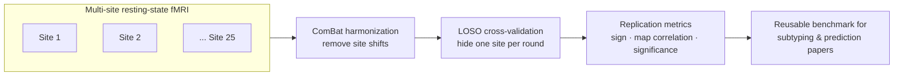

# Concept figure — MDD Subtyping Replication Framework

**Caption:** The replication pipeline. Resting-state fMRI connectivity features from ~25 scanning sites are harmonized with ComBat (site-specific shifts removed, biology preserved); then a leave-one-site-out (LOSO) loop discovers effects on N−1 sites and tests them on the hidden site; replication is scored by sign consistency, effect-map correlation, and held-out significance, producing an open, reusable benchmark for subtype-validation and treatment-prediction studies.

*A rendered PNG concept figure was generated for this repository; because binary assets cannot be committed through the tooling used for this update, this file carries the faithful Mermaid source of the same diagram.*
